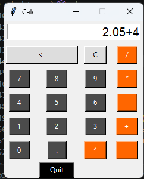
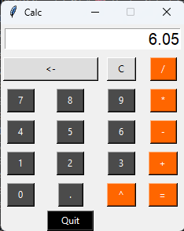
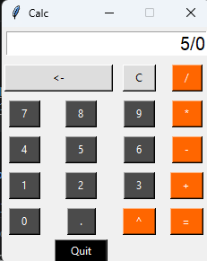
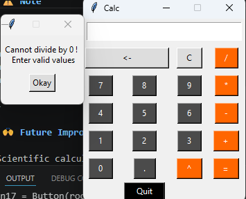

# 🧮 Tkinter Calculator App

A simple desktop calculator built using Python and Tkinter.
This application performs basic arithmetic operations with a clean GUI.

---

## 🚀 Features

* ➕ Addition
* ➖ Subtraction
* ✖️ Multiplication
* ➗ Division
* 🔢 Decimal support
* ⬅️ Backspace functionality
* 🧹 Clear input
* ⚡ Power operation (^)
* ⚠️ Error handling (division by zero)

---

## 🛠️ Tech Stack

* Python 3.x
* Tkinter (GUI library)

---

## 📂 Project Structure

```
calculator-app/
│── calculator.py
│── README.md
```

---

## ▶️ How to Run

### 1. Clone the repository

```
git clone https://github.com/your-username/calculator-app.git
cd calculator-app
```

### 2. Run the application

```
python calculator.py
```

---

## 🖥️ Output

A calculator window will open with buttons for numbers and operations.

---

## ⚠️ Note

* This project uses `eval()` for calculation, which is fine for learning but not recommended for production apps.
* Make sure Tkinter is installed (comes pre-installed with Python).

---

## 📸 Screenshot





---

## 🙌 Future Improvements

* Scientific calculator functions
* Better UI design
* Keyboard input support
* Dark mode

---

## 👨‍💻 Author

Sanket More

---

